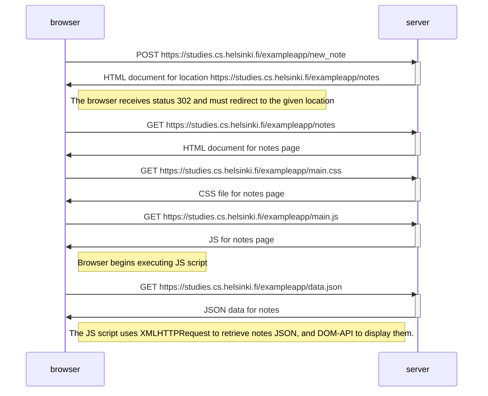

Exercise 0.4:

```mermaid

sequenceDiagram
    participant browser
    participant server

    browser->>server: POST https://studies.cs.helsinki.fi/exampleapp/new_note
    activate server
    server->>browser: HTML document for location https://studies.cs.helsinki.fi/exampleapp/notes
    deactivate server

    Note right of browser: The browser receives status 302 and must redirect to the given location

    browser->>server: GET https://studies.cs.helsinki.fi/exampleapp/notes
    activate server
    server->>browser: HTML document for notes page
    deactivate server

    browser->>server: GET https://studies.cs.helsinki.fi/exampleapp/main.css
    activate server
    server->>browser: CSS file for notes page
    deactivate server

    browser->>server: GET https://studies.cs.helsinki.fi/exampleapp/main.js
    activate server
    server->>browser: JS for notes page
    deactivate server

    Note right of browser: Browser begins executing JS script

    browser->>server: GET https://studies.cs.helsinki.fi/exampleapp/data.json
    activate server
    server->>browser: JSON data for notes
    deactivate server

    Note right of browser: The JS script uses XMLHTTPRequest to retrieve notes JSON, and DOM-API to display them.
```
