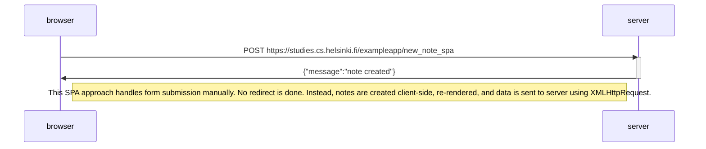

Exercise 0.6:

```mermaid

sequenceDiagram
    participant browser
    participant server

    browser->>server: POST https://studies.cs.helsinki.fi/exampleapp/new_note_spa
    activate server
    server->>browser: {"message":"note created"}
    deactivate server

    Note right of browser: This SPA approach handles form submission manually. No redirect is done. Instead, notes are created client-side, re-rendered, and data is sent to server using XMLHttpRequest.
```
